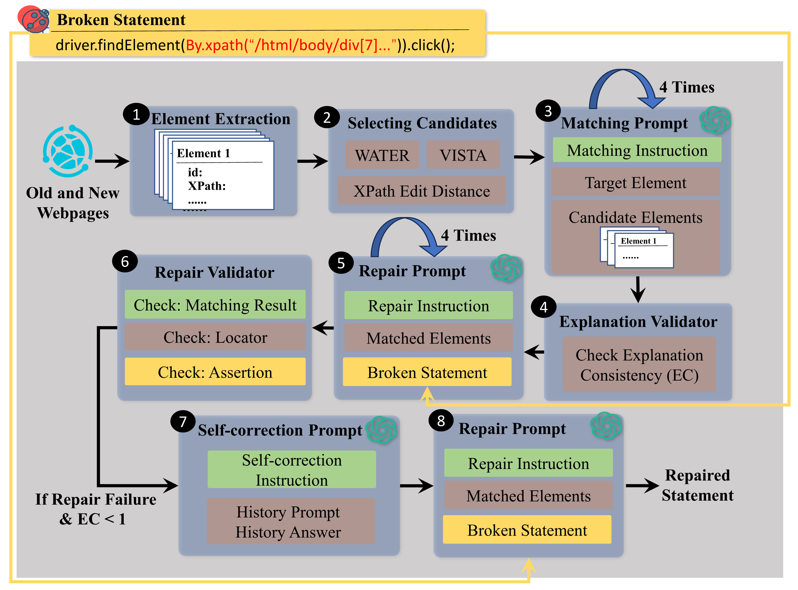

# ChatGPTUITestRepair

## Introduction

We present the first study that investigates the feasibility of using prior Web UI repair techniques for initial local matching and then using ChatGPT to perform global matching. Our key insight is thatGiven a list of elements matched by prior techniques, ChatGPT can leverage the language understanding to perform global view matching and use its code generation model for fixing the broken statements. To mitigate hallucination in ChatGPT, we design an explanation validator that checks whether the provided explanation for the matching results is consistent, and provides hints to ChatGPT via a self-correction prompt to further improve its results.

## Workflow

#### Element Extraction

Element extraction and candidate selection are finished with adapted UITestFix in folder ''Extraction''.

Running old web UI test scripts with UITestFix on old webpage can store the information of each element mentioned in each statement.

Then run old tests on the new webpage. UITestFix will catch  exception when breakage happens. It will also extract elements from new webpage. 

#### Selecting Candidate 

From all the element extracted on the new webpage, we can generate candidate list with desired size and candidate selection algorithms, and store them locally.

When adapted UITestFix detect breakages, it can load the target element information stored in previous step so that we know which element we want to match (called taret element in the workflow graph).

Based on the target element, adapted UITestFix can generate candidate list with desired size and candidate selection algorithms. In our experiment, we use three candidate selection approaches: VISTA, WATER and XPath Edit Distance.  You can implement other candidate selection algorithms in the framework and test its effectiveness.

#### Matching prompts

Use ''chatgpt_repair.py'' to send designed matching prompt to ChatGPT and store the answer correspondingly. You can also change the prompt according to your own design.

#### Explanation Validator

Firstly, run ''generate_attributes.py'' to format the information of target element and candidate elements generated in the element extraction step. 

Secondly, run ''generate_similarities.py'' to find out considering each attribute, which candidate element is the most similar one to the target element.

The file ''explanation_validator.py'' parse the matching result from ChatGPT's answer of matching prompt and the corresponding explanation. We ask ChatGPT to explain by listing the attribute it considered in matching. The validator check what attributes ChatGPT mentioned, and whether each mentioned attribute is most similar to that of target element on the old webpage.

#### Repair prompt

Use ''chatgpt_repair.py'' to send designed repair prompt to ChatGPT and store the answer correspondingly. You can also change the prompt according to your own design.

#### Repair Validator

"analysis_repair.py" parses the statement to separate locator part and other parts (e.g. assertion), and format them.

''analysis_repair1.py'' first checks whether the matching result is correct. If correct, then check whether the parts outside locator keep still. Thirdly, check whether ChatGPT repairs the locator according to given element information correctly.

If the parts outside locator change (this may happen because ChatGPT has diverse code generation patter), we manually check whether the changes are reasonable and compilable.

#### Self-correction

We filter the repair failure cases whose explanation consistency is lower than 1 to generate self-correction prompt and let ChatGPT to self-correct. The prompt will tell ChatGPT its previous selection and explanation, and explanation of which attributes are inconsistent judged by our explanation validator. If ChatGPT selects a different matching result under the self-correction prompt,  we will send repair prompt according to its new selection to it. 

After finishing, we validate the result again to check whether there is any improvement.

## Dataset

#### Dataset folder contains:

1. broken statements

2. corresponding labelled ground-truth (we record the XPath of the desired element on the new webpage)

3. candidate elements generated by 3 different approaches (for each broken statement)

4. target elements (for each broken statement)

5. prompts (matching prompt, repair prompt and self-correctness prompt)

6. corresponding answers

## links for the dataset systems and tests

#### Project: Links (last updated)

AddressBook: [https://sourceforge.net/projects/php-addressbook/files/php-addressbook/](https://sourceforge.net/projects/php-addressbook/files/php-addressbook/) (2010-07)

Claroline: [https://sourceforge.net/projects/claroline/files/](https://sourceforge.net/projects/claroline/files/) (2015-03)

Collabtive: [https://sourceforge.net/projects/collabtive/files/collabtive/](https://sourceforge.net/projects/collabtive/files/collabtive/)  (2017-09)

MantisBT: [https://github.com/mantisbt/mantisbt/](https://github.com/mantisbt/mantisbt/) (2024-05)

MRBS: [https://sourceforge.net/projects/mrbs/files/mrbs/](https://sourceforge.net/projects/mrbs/files/mrbs/) (2024-04)

#### Test links: Links (last updated) 

[18] An automated model-based approach to repair test suites of evolving web applications: [https://github.com/javariaimtiaz12/Selenium-Test-Scripts-for-Web](https://github.com/javariaimtiaz12/Selenium-Test-Scripts-for-Web) (2020-09)

[28] Automated Fixing of Web UI Tests via Iterative Element Matching: [https://anonymous.4open.science/r/Web-UI-Dataset-9645](https://anonymous.4open.science/r/Web-UI-Dataset-9645) (2024-03)

